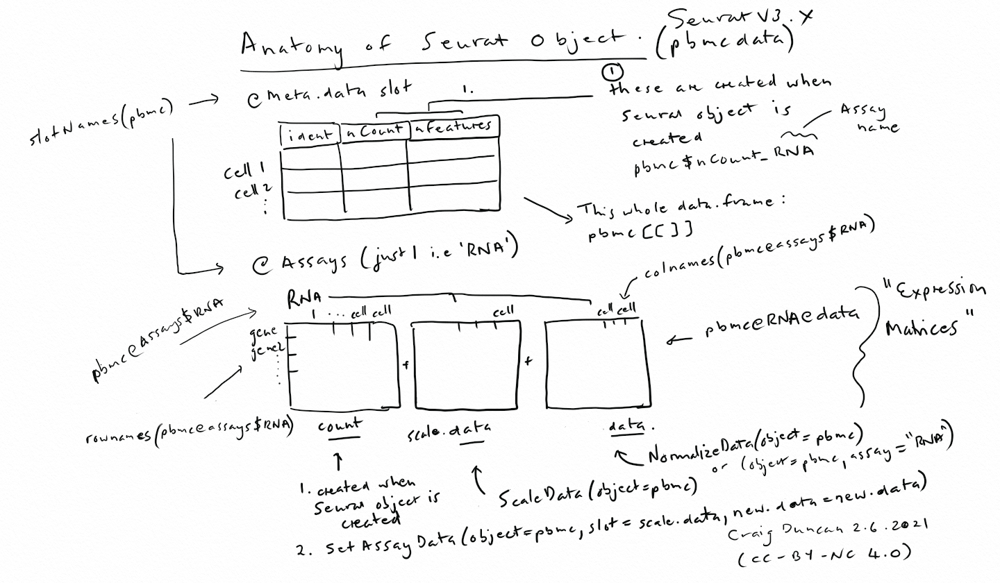

```{r setup, include=FALSE}
knitr::opts_chunk$set(echo = TRUE)
```

# Seurat Setup

We need at least R version 4 installed to run Seurat.

Change the extension of this file to .Rmd in this repo so you can run it in R Studio.  It's a markdown file here so that it displays nicely in Github.

Having done that, we start by downloading and installing the 'pbmc3k' data in a local directory (it needs to match the Read10X location below).

```{R}
# install.packages('Seurat')
library(dplyr)
library(Seurat) 
library(Matrix)
```
Go get your data to test:

1. Load the PBMC dataset [note Seurat comes with a pbmc_small example but since it has already had some preprocessing steps applied to it, this file provides an illustration with less in-built assumptions]

2. Download the pbmc data as recommended at the [SeuratTutePage](https://satijalab.org/seurat/archive/v3.0/pbmc3k_tutorial.html).  Seurat comes pre-installed with only a small version of this data (pbmc_small). 

When you have downloaded the data and put it into the data folder and subfolders as described above, run this script:

```{R}
pbmc.data <- Read10X(data.dir = "data/pbmc3k/filtered_gene_bc_matrices/hg19/")
# Create Seurat object
pbmc <- CreateSeuratObject(counts = pbmc.data, project = "pbmc3k", min.cells = 3, min.features = 200)
```

# Visual help (Anatomy of Seurat Object)



This summary workflow (below) will crunch the count data, but it doesn't dwell on the preceding data preparation work that is done in the initial sequencing process or for the initial genes-per-cell counting (perhaps using CellRanger software, which internally uses STAR) as contained in the 10X count-data files (the .mtx, barcodes and genes/features files).  The first couple of steps repeat the data load from above.

# Compressed Seurat workflow

The series of commands that can comprise a workflow are based on information here: [SatijaLab_Commands](https://satijalab.org/seurat/articles/essential_commands.html)

Read in the data.  This workflow is based on the input of data from hg19 folder containing the 3 matrix files that are the output from CellRanger.

```{R}
pbmc.counts <- Read10X(data.dir = "data/pbmc3k/filtered_gene_bc_matrices/hg19/")
```

Make your Seurat Object from the pbmc.counts data :
```{R}
pbmc <- CreateSeuratObject(counts = pbmc.counts)
```


At this stage we have two matrices in the "Assay" object, namely count and data:
```{R}
slotNames(pbmc)
pbmc@assays # called 'RNA'.  It's also the active.assay (there's only 1 here!)
```

What's in RNA Assay? Reference the specific assays content using $
```{R}
pbmc@assays$RNA

colnames(pbmc@assays$RNA) # this RNA assay has cell names for its columns
```

```{R}
rownames(pbmc@assays$RNA) # the gene names in the count
```

Normalise the data (updates one of expression matrices in active.assay (here: 'RNA'))

```{R}
pbmc <- NormalizeData(object = pbmc)
```

Begin differential expression analysis:

```{R}
pbmc <- FindVariableFeatures(object = pbmc)
```

Scale the data:
```{R}
pbmc <- ScaleData(object = pbmc)
```

Do some clustering analysis:
```{R}
pbmc <- RunPCA(object = pbmc)
pbmc <- FindNeighbors(object = pbmc)
pbmc <- FindClusters(object = pbmc)
pbmc <- RunTSNE(object = pbmc)
```

Now plot:
```{R}
DimPlot(object = pbmc, reduction = "tsne")
```

For the clustering analysis, there won't be any cell classes or subsets unless they've been automatically created in the FindVariableFeatures step.

Initially, the 'idents' (the column holding your cell classes/classification data) is set to whatever is in this slot:

```{R}
pbmc@active.ident # output a factor (lists category for each cell)
```

The default 'factor' or category might be the project name, rather than the Seurat object name.

To set your own identities you will use Ident(object=pbmc) to access the active identity factor (you use this in an R expression to set your new factors for selected cells).

e.g. Ident(object=pbmc)<-"new.idents" or for a subset of cells Idents(object = object, cells = 1:10) <- "new.idents"

I'll deal with the way in which these are used separately.